# Spring Boot PetClinic Migration & Modernization Workshop

This workshop demonstrates how to migrate and modernize the iconic Spring Boot PetClinic application from local execution to cloud deployment on Azure AKS Automatic. Participants will experience the complete modernization journey using AI-powered tools: GitHub Copilot Application Modernization for Java and <container tool>.

## 🎯 Workshop Goals

- **Simulate On-Prem Execution**: Run [Spring Boot PetClinic](https://github.com/spring-projects/spring-petclinic) locally with PostgreSQL using basic authentication representative of on-prem legacy Java workloads
- **Code Modernization**: Use [GitHub Copilot Application Modernization for Java](https://marketplace.visualstudio.com/items?itemName=vscjava.vscode-java-upgrade) to modernize elements of the workload
- **Cloud Migration**: Migrate from self-hosted Postgres to [Azure PostgreSQL Flexible Server](https://learn.microsoft.com/azure/postgresql/flexible-server/) with [Entra ID authentication](https://learn.microsoft.com/en-us/azure/active-directory/)
- **Containerization**: Use <container tool> to generate Docker and Kubernetes manifests for deployment
- **AKS Deployment**: Deploy to [AKS Automatic](https://learn.microsoft.com/azure/aks/automatic/) with [workload identity](https://learn.microsoft.com/en-us/azure/aks/workload-identity-overview) and [service connector](https://learn.microsoft.com/azure/service-connector/)

## 📁 Workshop Structure

```
mm-springboot-petclinic-to-aks-automatic/
├── README.md                           # This file - Complete workshop guide
├── plan.md                             # Detailed workshop plan (temporary)
├── scripts/                            # Automation scripts
│   ├── quickstart.sh                  # One-command workshop setup
│   └── setup-azure-infrastructure.sh  # Azure resource creation
├── src/                                # Spring Boot PetClinic application (created during setup)
├── manifests/                          # Generated Kubernetes manifests (empty initially)
├── config/                             # Configuration files (empty initially)
└── images/                             # Workshop screenshots and diagrams
```

## 🚀 Quick Start

### Prerequisites Check
Ensure you have the following tools installed and available:
- [Azure CLI](https://learn.microsoft.com/en-us/cli/azure/install-azure-cli) (logged in with `az login`)
- [Java 17 or 21](https://learn.microsoft.com/en-us/java/openjdk/download) (Microsoft OpenJDK)
- Maven 3.8+
- Docker Desktop or equivalent
- [VS Code with Java Extension Pack](https://marketplace.visualstudio.com/items?itemName=vscjava.vscode-java-pack)
- [GitHub Copilot App Modernization Extension Pack](https://marketplace.visualstudio.com/items?itemName=vscjava.vscode-java-upgrade)
- [kubectl](https://learn.microsoft.com/en-us/azure/aks/learn/quick-kubernetes-deploy-cli#install-the-azure-cli-and-kubernetes-cli) (available via Azure AKS client tools)
- Bash/Zsh shell (Linux or macOS or Windows w/WSL2v2)

### Module 1: Setup Petclinic locally and test

1. Run the automated setup script:
   ```bash
   chmod +x scripts/*.sh
   ./scripts/quickstart.sh
   ```

2. Test the Spring Petclinic application locally using self-hosted Postgres:
   ```bash
   # Check if PostgreSQL container is running
   docker ps | grep petclinic-postgres
   
   # Test the application with all configuration
   cd src
   mvn spring-boot:run -Dspring-boot.run.arguments="--spring.messages.basename=messages/messages --spring.datasource.url=jdbc:postgresql://localhost/petclinic --spring.sql.init.mode=always --spring.sql.init.schema-locations=classpath:db/postgres/schema.sql --spring.sql.init.data-locations=classpath:db/postgres/data.sql --spring.jpa.hibernate.ddl-auto=none"
   cd ..
   
   # Wait for application to fully start
   echo "⏳ Waiting 30 seconds for application to start..."
   sleep 30

   # Open in browser for manual verification
   open http://localhost:8080
   ```

**💡 Explore the PetClinic Application:**
Once the application is running in your browser, take some time to explore the functionality:
- **Find Owners**: Go to "FIND OWNERS" → leave the "Last Name" field blank → click "Find Owner" to see all 10 owners
- **View Owner Details**: Click on an owner like "Betty Davis" to see their information and pets
- **Edit Pet Information**: From an owner's page, click "Edit Pet" to see how pet details are managed
- **Review Veterinarians**: Navigate to "VETERINARIANS" to see the 6 vets with their specialties (radiology, surgery, dentistry)

3. Next, let's open the Petclinic project in VS Code and begin our modernization work. Open a terminal and change to the mm-springboot-petclinic-to-aks-automatic directory. Run the following command to launch VS Code into the root of the lab contents:
   ```bash
   code src/
   ```

---

### Module 2: Application Modernization
**What You'll Do:** Use GitHub Copilot Application Modernization for Java to assess, remediate, and modernize the Spring Boot application in preparation to migrate the workload to AKS Automatic
**What You'll Learn:** How GitHub Copilot Application Modernization for Java work, demonstration of modernizing elements of legacy applications, and the modernization workflow

**Detailed Steps:**

### Step 1: Select the GitHub App Modernization Extension
After VS Code opens with the Spring PetClinic project in focus, select the GitHub App Modernization for Java extension from the Activity Bar (cloud icon with J and arrows)

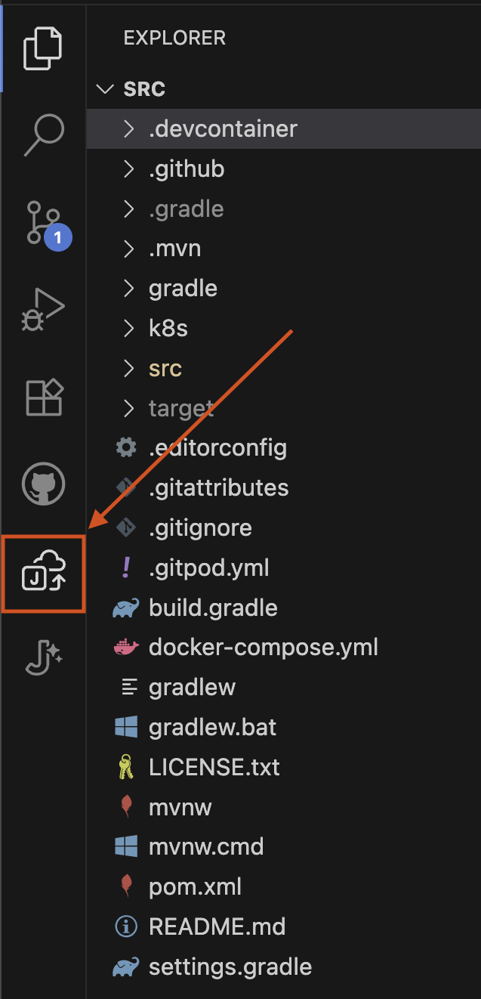

### Step 2: Navigate the Extension Interface
You'll see the extension interface with two main sections: "QUICKSTART" and "ASSESSMENT". Click "Migrate to Azure" to begin the modernization process

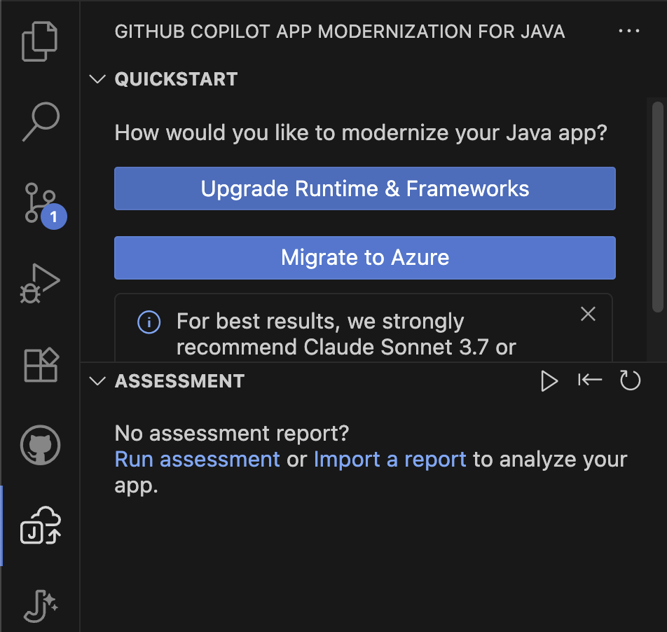

### Step 3: Grant MCP Server Permission
This opens GitHub Copilot chat in agent mode, asking for permission to start the App Modernization for Java MCP server. Click "Allow" to grant permission and continue with the assessment

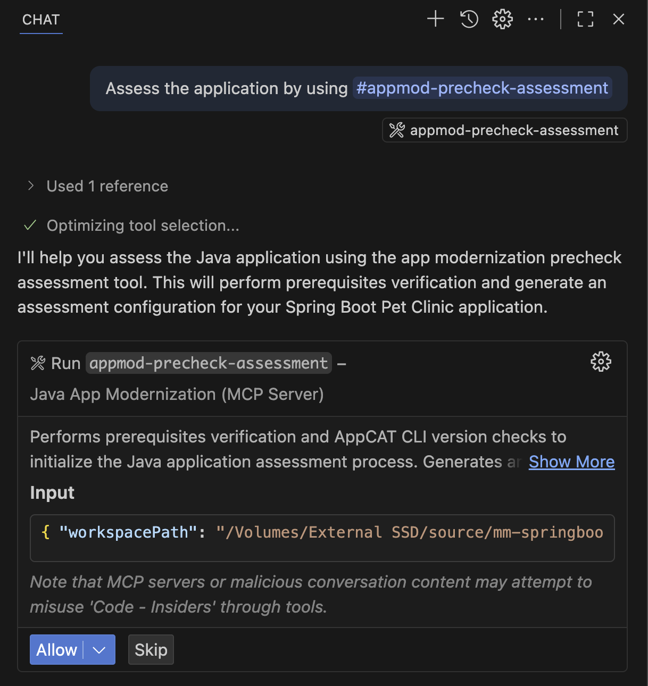

### Step 4: Execute Precheck Assessment
The tool will execute "appmod-precheck-assessment" and show successful completion

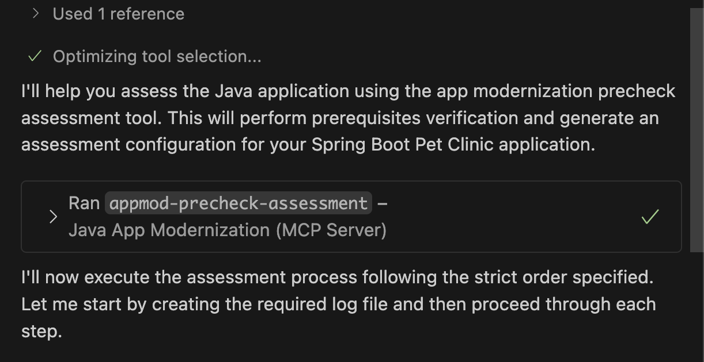

### Step 5: Review Generated Artifacts
A .github folder is created to store modernization artifacts and logs. When using App Mod for Java, the `.github/appmod-java` directory typically houses assessment outputs like logs and configuration under `appcat`, with code migration artifacts found in the `code-migration` folder.

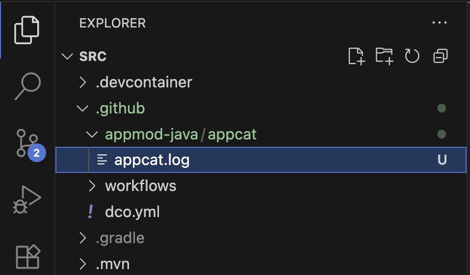
   
### Step 6: Review AppCAT Configuration Options
Scroll down in the GitHub Copilot chat to see the AppCAT tool configuration represented as JSON. 

**What is AppCAT?**
[AppCAT for Java](https://learn.microsoft.com/en-us/azure/migrate/appcat/java?view=migrate-classic) is Azure Migrate's application and code assessment tool that analyzes your Java application to identify modernization opportunities for Azure. It examines your code structure, dependencies, and configurations to recommend specific improvements for cloud deployment.

**Configuration Options:**
The tool offers several analysis targets and modes:

**Analysis Targets:**
- `azure-aks` - Selects AppCAT rules relavent to moving pre-containerized workloads to AKS
- `openjdk17` - Identifies Java 17 upgrade opportunities and compatibility issues
- `cloud-readiness` - General pre-container workload optimization recommendations

**Analysis Modes:**
- `source-only` - Analyzes source code without dependency scanning (faster execution)
- `full` - Comprehensive analysis including both code and dependency scanning

**What AppCAT Does:**
- **Discovers technology usage** in your legacy applications
- **Assesses code for specific Azure targets** (AKS, App Service, Container Apps)
- **Identifies modifications needed** to replatform to Azure
- **Provides Azure-specific replatforming rules** and best practices

The results of the AppCAT scan are passed into Github Copilot Application Modernization for Java which uses the context of the findings to suggest opportunities for modernization in preparation for containerizing and migrating the workload to Azure.

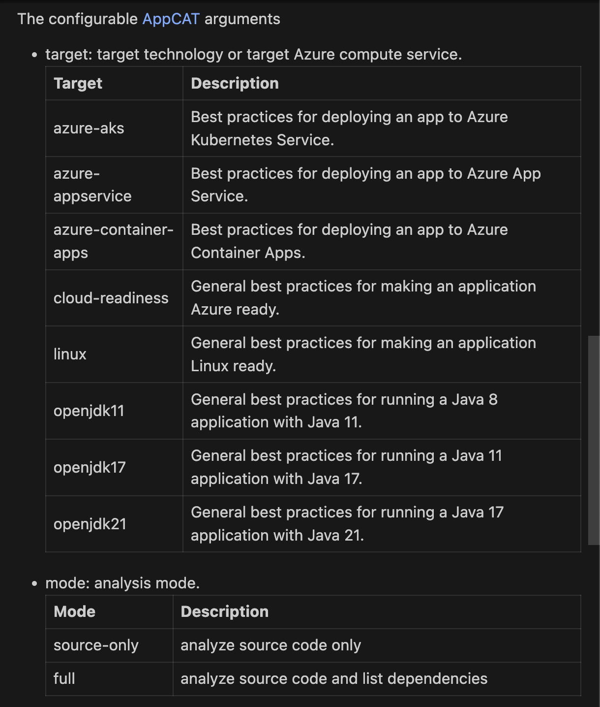

#### Configure Assessment Parameters
In the GitHub Copilot chat, you'll see the "Run `appmod-run-assessment`" tool with configuration options. This is where you may customize the assessment targets and analysis mode. 

   **Default Configuration:**
   ```json
   {
     "workspacePath": "<path to project>/src",
     "appCatConfig": {
       "target": ["azure-aks", "azure-appservice", "azure-container-apps", "cloud-readiness"],
       "mode": "source-only"
     }
   }
   ```
    
   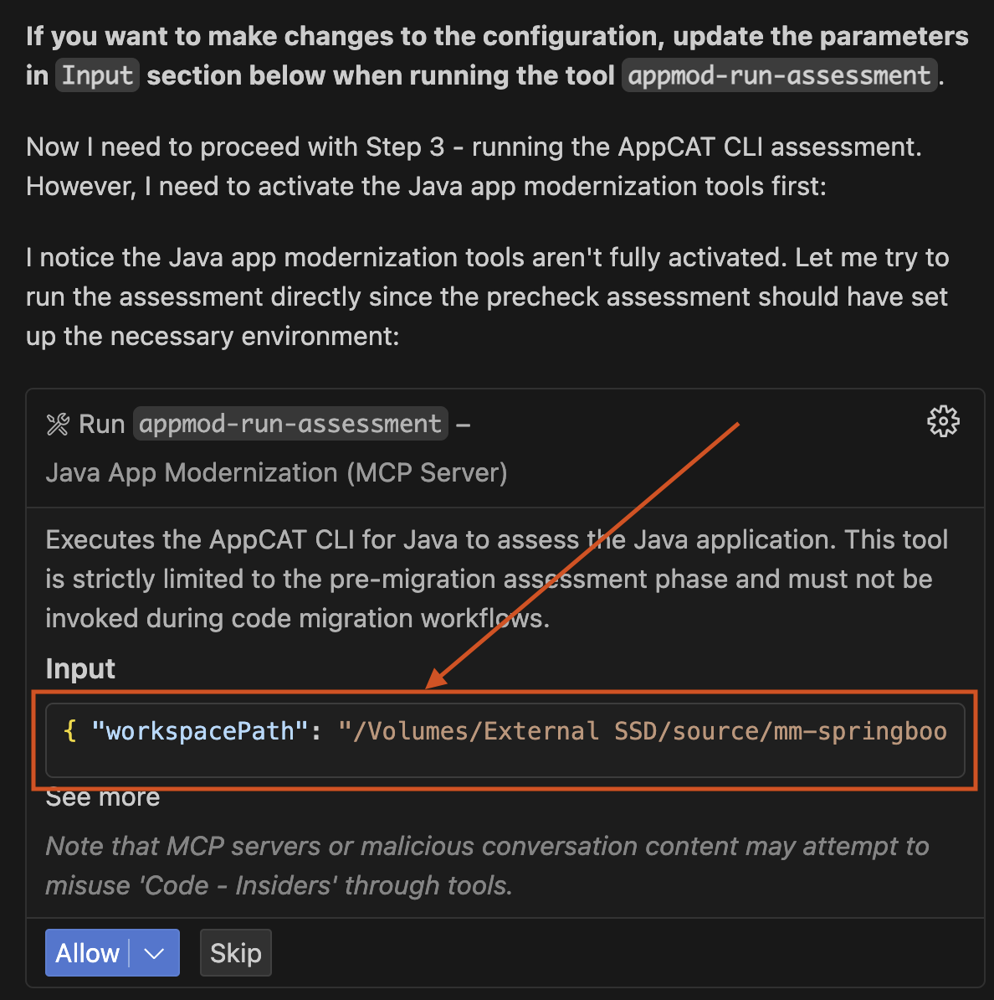

### Step 7: Execute Assessment
Click the "Run" button to start the assessment. The tool will analyze your Spring Boot PetClinic application using the configured analysis parameters.

### Step 8: Review Assessment Results
After the assessment completes, you'll see a success message in the GitHub Copilot chat summarizing what was accomplished:

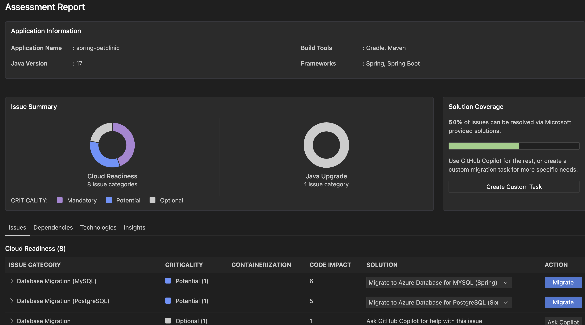

### Step 9: Review Detailed Assessment Report
The assessment report opens in VS Code showing detailed findings:

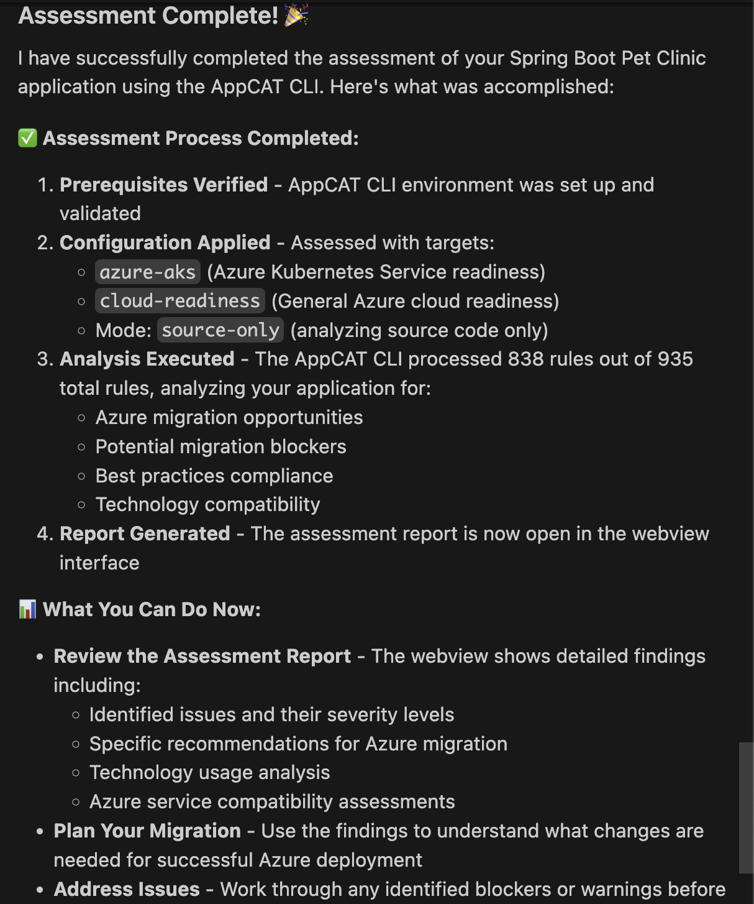

**Assessment Report Overview:**
The assessment report details the analysis of the Spring Boot Petclinic application's cloud readiness, in this case identifying 8 cloud readiness issues and 1 Java upgrade opportunity. The report indicates that over 50% of the identified issues can be resolved in Java code and configuration updates using migration capabilities built into Github Copilot Application Modernization for Java. Each finding is categorized by criticality level: Mandatory issues (purple) require attention first, while Potential issues (blue) represent optimization opportunities, and Optional issues (gray) are nice to have improvements that may be addressed later.

### Step 10: Review Specific Findings
Click on individual issues in the report to see detailed recommendations. In practice, you would review all recommendations and determine the set that aligns with your migration and modernization goals for the application.

For this lab, we will spend our time focusing on two modernization recommendations: updating the code to use modern authentication via Azure Database for PostgreSQL Flexible Server with Entra ID authentication and updating the code to remove embedded cache management and move to using Azure Cache for Redis.

**Modernization Lab Focus #1** - Database Migration to Azure PostgreSQL Flexible Server
- **What was found**: PostgreSQL database configuration using basic authentication detected in  application files
- **Why this matters**: External dependencies like on-premises databases with legacy authentication must be resolved before migrating to Azure
- **Files affected**: `pom.xml`, `build.gradle`, `application.properties`, `application-postgres.properties`
- **Recommended solution**: Migrate to Azure Database for PostgreSQL Flexible Server
- **Benefits**: Managed service with automatic backups, scaling, and high availability

**Modernization Lab Focus #2**  - Embedded Cache Management to Azure Cache for Redis
- **What was found**: Spring Boot Cache library embedded within the application
- **Why this matters**: Embedded caching doesn't work when deploying to Kubernetes with multiple replicas
- **File affected**: `pom.xml` (Line 50)
- **Recommended solution**: Migrate to Azure Cache for Redis
- **Benefits**: Distributed caching that scales with your application

### Step 11: Take Action on Findings
Based on the assessment findings, GitHub Copilot Application Modernization for Java provides two types of migration actions to assist with modernization opportunities. The first is **guided migrations** (blue "Migrate" button), which offer fully guided, step-by-step remediation flows for common migration patterns that the tool has been trained to handle. The second is **unguided migrations** ("Ask Copilot" button), which provide AI assistance with context aware guidance and code suggestions for more complex or custom scenarios.

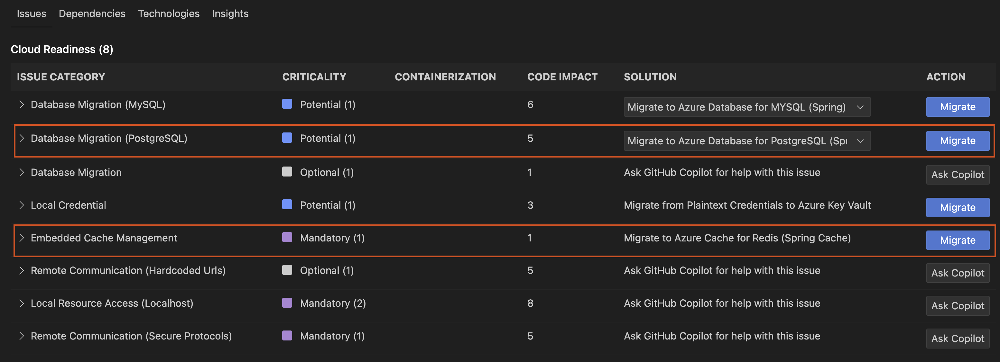

For this workshop, we'll focus on two modernization areas that demonstrate how to externalize dependencies in the workload to Azure PaaS before deploying to AKS Automatic. First, we'll migrate from self-hosted PostgreSQL with basic authentication to Azure PostgreSQL Flexible Server using Entra ID authentication with AKS Workload Identity. Second, we'll migrate from in-memory Spring caching to Azure Cache for Redis, also using Entra ID authentication with AKS Workload Identity.

### Step 12: Select PostgreSQL Migration Task
Begin the modernization by selecting the desired migration task. For our Spring Boot application, we will migrate to Azure PostgreSQL Flexible Server using the Spring option. The other options shown are for generic JDBC usage.

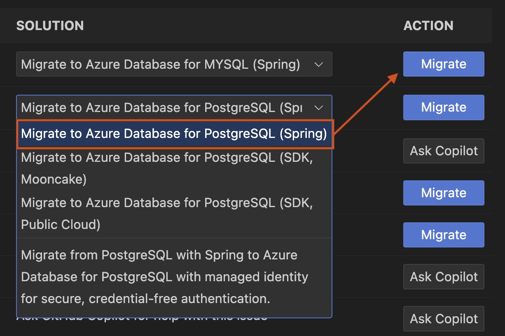

**Note:** Choose the "Spring" option for Spring Boot applications, as it provides Spring-specific optimizations and configurations. The generic JDBC options are for non-Spring applications.

### Step 13: Execute Postgres Migration Task
Click the "Migrate" button described in the previous section to kick off the modernization changes needed in the PetClinic app. This will update the Java code to work with PostgreSQL Flexible Server using Entra ID authentication.

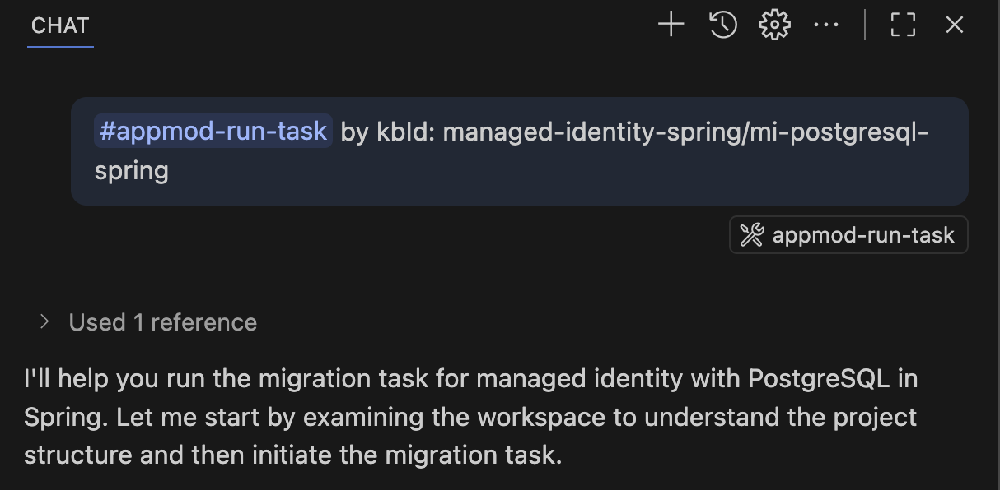

The tool will execute the `appmod-run-task` command for `managed-identity-spring/mi-postgresql-spring`, which will examine the workspace structure and initiate the migration task to modernize your Spring Boot application for Azure PostgreSQL with managed identity authentication. If prompted to run shell commands, please review and allow each command as the Agent may require additional context before execution.

When the migration task for PostgreSQL with Entra ID authentication begins to run, you will see a chat similar to this in the agent interface:

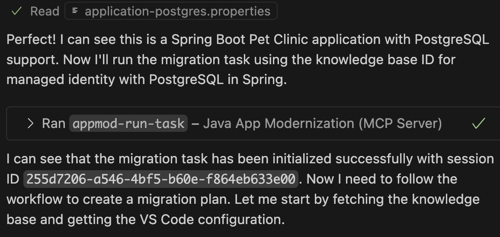

### Step 14: Review Migration Plan and Begin Code Migration
The App Modernization tool has analyzed your Spring Boot application and generated a comprehensive migration plan. This plan outlines the specific changes needed to implement Azure Managed Identity authentication for PostgreSQL connectivity.

**Migration Plan Overview:**
The tool will implement the following key changes:
- **Add Spring Cloud Azure Dependencies**: Integrate Spring Cloud Azure BOM version 5.22.0 and the `spring-cloud-azure-starter-jdbc-postgresql` dependency to both Maven and Gradle build files
- **Configure Managed Identity Authentication**: Update application configuration files to replace username/password authentication with Azure Managed Identity, enabling passwordless database connectivity

**Files to be Modified:**
- `pom.xml` and `build.gradle` - Add Spring Cloud Azure dependencies
- `application.properties` and `application-postgres.properties` - Configure managed identity authentication settings

**Migration Tracking:**
The tool will create tracking files (`plan.md` and `progress.md`) in the `.github/appmod-java/code-migration/managed-identity-spring/mi-postgresql-spring-[timestamp]` directory to document all changes and provide full visibility into the migration process.

**Version Control Setup:**
- A new Git branch will be created for the migration work
- Uncommitted changes will be automatically stashed
- Migration session ID will be provided for tracking

**To Begin Migration:**
Type **"Yes"** in the GitHub Agent Chat to initiate the automated code migration process.

### Step 15: Review Migration Process and Progress Tracking
Once you confirm with "Yes", the migration tool begins implementing changes using a structured, two-phase approach designed to ensure reliability and provide clear rollback capabilities if needed.

**Migration Overview:**
The tool implements a systematic approach that separates dependency updates from configuration changes, allowing for independent validation of each phase and better error handling.

**Version Control Setup:**
The tool automatically manages version control to ensure your work is protected:
- **Stash uncommitted changes**: Any local modifications (like `application.properties` changes) are safely stashed
- **Create dedicated branch**: New branch `appmod/java-managed-identity-spring/mi-postgresql-spring-[timestamp]` is created for all migration work
- **Clean working directory**: Ensures a consistent starting point for the migration

**Two-Phase Migration Process:**

**Phase 1: Update Dependencies**
- **Purpose**: Add the necessary Azure libraries to your project
- **Changes made**:
  - Updates `pom.xml` with Spring Cloud Azure BOM and PostgreSQL starter dependency
  - Updates `build.gradle` with corresponding Gradle dependencies
  - Adds Spring Cloud Azure version properties
- **Validation**: Ensures all new dependencies are properly integrated

**Phase 2: Configure Application Properties**
- **Purpose**: Update configuration files to use managed identity authentication
- **Changes made**:
  - Updates `application.properties` to configure PostgreSQL with managed identity (9 lines added, 2 removed)
  - Updates `application-postgres.properties` with Entra ID authentication settings (5 lines added, 4 removed)
  - Replaces username/password authentication with managed identity configuration
- **Validation**: Ensures configuration changes work with the updated dependencies

**Progress Tracking:**
The `progress.md` file provides real-time visibility into the migration process:
- **Change documentation**: Detailed log of what changes are being made and why
- **File modifications**: Clear tracking of which files are being updated
- **Rationale**: Explanation of the reasoning behind each modification
- **Status updates**: Real-time progress of the migration work

**Validation & Fix Iteration Loop:**
After implementing the migration changes, the tool automatically validates the results through a comprehensive testing process:

- **CVE Validation**: Scans newly added dependencies for known security vulnerabilities
- **Build Validation**: Attempts to build the project and captures any compilation or dependency errors
- **Automated Fixes**: Uses error output to automatically attempt fixes for common issues
- **Iterative Process**: Continues through multiple validation cycles (up to 10 iterations) until the build succeeds

This systematic approach ensures your Spring Boot application is successfully modernized for Azure PostgreSQL with Entra ID authentication while maintaining full functionality.

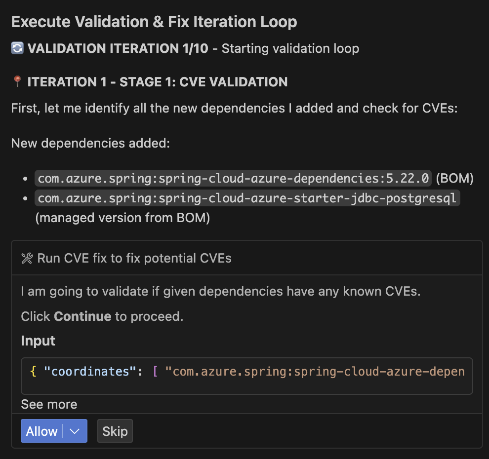

**User Control:**
At any point during this validation process, you can interrupt the automated fixes and manually resolve issues if you prefer to handle specific problems yourself. The tool provides clear feedback on what it's attempting to fix and allows you to take control when needed.

### Step 16: Validation and Fix Iteration Loop
The App Modernization tool implements a comprehensive validation process to ensure the migration changes are secure, functional, and consistent. This automated validation runs through multiple stages to verify the integrity of the migration.


*Figure: Execute Validation & Fix Iteration Loop - CVE validation process for newly added Azure Spring dependencies*

**Validation Stages:**
1. **CVE Validation** ✅ - Scans newly added dependencies for known security vulnerabilities
2. **Build Validation** ✅ - Verifies the application compiles and builds successfully after migration changes
3. **Consistency Validation** ✅ - Ensures all configuration files are properly updated and consistent
4. **Test Validation** ⚠️ - Executes application tests to verify functionality remains intact

**Automated Error Detection and Resolution:**
The tool includes intelligent error detection capabilities that automatically identify and resolve common issues:
- Parses build output to detect compilation errors
- Identifies root causes of test failures
- Applies automated fixes for common migration issues
- Continues through validation iterations until all issues are resolved

This automated validation ensures your application maintains full functionality while implementing the security improvements from the migration.

### Step 17: Review Migration Completion Summary
Upon successful completion of the validation process, the App Modernization tool presents a comprehensive migration summary report confirming the successful implementation of Azure Managed Identity authentication for PostgreSQL in your Spring Boot application.

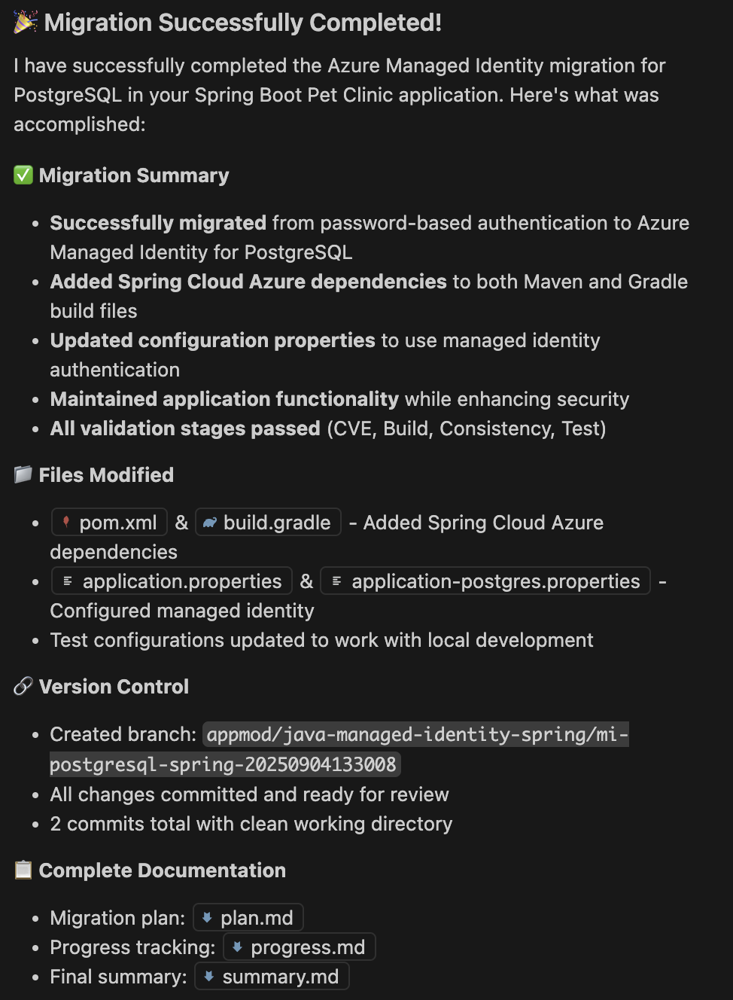

**Migration Accomplishments:**
The migration successfully transformed your application from password-based authentication to Azure Managed Identity for PostgreSQL, significantly enhancing security while maintaining full application functionality. The process integrated Spring Cloud Azure dependencies, updated configuration properties for managed identity authentication, and ensured all validation stages passed including CVE scanning, build validation, consistency checks, and test execution.

**Configuration-Driven Approach:**
A key advantage of this migration is that no Java code changes were required. Spring Boot's configuration-driven architecture automatically handles database connection details based on the configuration files. When switching from password authentication to managed identity, Spring reads the updated configuration and automatically uses the appropriate authentication method. Your existing Java code for database operations (such as saving pet records or retrieving owner information) continues to function identically, but now connects to the database using the more secure managed identity approach.

**Files Modified:**
The migration process updated the following configuration files:
- `pom.xml` and `build.gradle` - Added Spring Cloud Azure dependencies
- `application.properties` and `application-postgres.properties` - Configured managed identity authentication
- Test configurations - Updated to work with the new authentication method

**Version Control Integration:**
All changes were automatically committed to a new branch (`appmod/java-managed-identity-spring/mi-postgresql-spring-[timestamp]`) with comprehensive documentation including migration plan (`plan.md`), progress tracking (`progress.md`), and final summary (`summary.md`) files for complete visibility into the migration process and outcomes.

---

### Module 3: Deploy Azure Infrastructure
**What You'll Do:** Create all required Azure resources using automated scripts
**What You'll Learn:** Azure resource management, PostgreSQL Flexible Server, AKS Automatic, and workload identity concepts

**Detailed Steps:**
1. Run the Azure infrastructure setup script:
   ```bash
   ./scripts/setup-azure-infrastructure.sh
   ```

2. Verify all resources are created successfully:
   ```bash
   # Check resource group
   az group show --name petclinic-workshop-rg
   
   # Check PostgreSQL server
   az postgres flexible-server list --resource-group petclinic-workshop-rg
   
   # Check AKS cluster
   az aks list --resource-group petclinic-workshop-rg
   ```

3. Configure application for Azure PostgreSQL:
   ```bash
   # Source environment variables
   source .env
   
   # Create Azure-specific application properties
   cat > src/src/main/resources/application-azure.properties << EOF
   spring.datasource.url=jdbc:postgresql://${POSTGRES_SERVER}:5432/petclinic?sslmode=require
   spring.datasource.username=${POSTGRES_USER}
   spring.datasource.password=${POSTGRES_PASSWORD}
   spring.datasource.driver-class-name=org.postgresql.Driver
   spring.jpa.hibernate.ddl-auto=create-drop
   spring.jpa.properties.hibernate.dialect=org.hibernate.dialect.PostgreSQLDialect
   spring.jpa.show-sql=true
   spring.jpa.properties.hibernate.format_sql=true
   EOF
   ```

**What this creates:**
- Resource group: `petclinic-workshop-rg`
- Azure PostgreSQL Flexible Server
- AKS Automatic cluster with workload identity
- Azure Container Registry
- Service connector between AKS and PostgreSQL

**Expected Result**: All Azure resources created and configured with workload identity and service connector.

---

### Module 4: Generate Containerization Assets
**What You'll Do:** Use <container tool> to create Docker and Kubernetes manifests
**What You'll Learn:** How AI-powered tools can generate production-ready containerization assets

**Detailed Steps:**
1. Configure <container tool> for the application:
   - In VS Code, open Command Palette
   - Select "<container tool>: Generate Dockerfile and Kubernetes Manifests"

2. Generate optimized Dockerfile:
   - Follow the guided process
   - Configure for Spring Boot application
   - Set appropriate base image and optimizations

3. Create Kubernetes deployment manifests:
   - Generate deployment, service, and ingress configurations
   - Configure health checks and readiness probes
   - Set up service configuration for internal communication

4. Review and validate generated assets:
   ```bash
   # Check generated Dockerfile
   cat Dockerfile
   
   # Check generated Kubernetes manifests
   ls -la manifests/
   cat manifests/deployment.yaml
   cat manifests/service.yaml
   ```

**Expected Result**: Production-ready Dockerfile and Kubernetes manifests generated by AI tools.

---

### Module 5: Deploy to AKS
**What You'll Do:** Deploy the modernized application to Azure Kubernetes Service
**What You'll Learn:** Kubernetes deployment, service management, and testing deployed applications

**Detailed Steps:**
1. Apply Kubernetes manifests to AKS:
   ```bash
   # Apply Kubernetes manifests
   kubectl apply -f manifests/
   ```

2. Monitor deployment status:
   ```bash
   # Check deployment status
   kubectl get pods
   kubectl get services
   kubectl get deployments
   ```

3. Configure service access:
   ```bash
   # Port forward to local machine
   kubectl port-forward svc/petclinic-service 8080:80
   ```

4. Test the deployed application:
   ```bash
   # Test the application
   curl http://localhost:8080
   ```

5. Verify database connectivity:
   ```bash
   # Check pod logs for database connection
   kubectl logs <pod-name>
   ```

**Expected Result**: Application successfully deployed to AKS with generated Docker and Kubernetes manifests.

---

### Step 6: Cleanup Resources
**What You'll Do:** Remove all Azure resources and clean up local environment
**What You'll Learn:** Best practices for resource cleanup and cost management

**Detailed Steps:**
1. Remove Azure resource group:
   ```bash
   # Delete entire resource group (this will clean up all resources)
   az group delete --name petclinic-workshop-rg --yes --no-wait
   ```

2. Stop local containers:
   ```bash
   # Stop and remove local PostgreSQL container
   docker stop petclinic-postgres
   docker rm petclinic-postgres
   ```

3. Clean up local files:
   ```bash
   # Stop local application (if still running)
   pkill -f "spring-boot:run"
   ```

4. Verify cleanup completion:
   ```bash
   # Check if containers are stopped
   docker ps | grep petclinic
   
   # Check if application is stopped
   curl -s http://localhost:8080 || echo "Application stopped"
   ```

## 🧪 Testing & Validation

### Local Application Test
- ✅ Application accessible at http://localhost:8080
- ✅ Database connection working (check logs for Hibernate messages)
- ✅ Basic PetClinic functionality working

### Azure Infrastructure Test
- ✅ PostgreSQL server accessible from AKS
- ✅ AKS cluster running with workload identity enabled
- ✅ Service connector configured between AKS and PostgreSQL

### Deployed Application Test
- ✅ Application pods running successfully
- ✅ Service accessible via kubectl port-forward
- ✅ Application connecting to Azure PostgreSQL

## 📋 Workshop Progress Checklist

### ✅ Pre-Workshop Setup
- [ ] Azure CLI installed and logged in
- [ ] Java 17 or 21 installed
- [ ] Maven 3.8+ installed
- [ ] Docker Desktop running
- [ ] VS Code with Java Extension Pack
- [ ] GitHub Copilot App Modernization extension installed
- [ ] kubectl installed
- [ ] Workshop repository cloned

### 🚀 Step 1: Automated Setup
- [ ] Run `./scripts/quickstart.sh`
- [ ] Verify `src/` directory created with PetClinic code
- [ ] Confirm PostgreSQL container running
- [ ] Test local application at http://localhost:8080
- [ ] Open project in VS Code: `code src/`

### 🔧 Step 2: Code Modernization
- [ ] Install GitHub Copilot App Modernization extension
- [ ] Run "GitHub Copilot: Modernize Java Application"
- [ ] Upgrade Spring Boot version
- [ ] Update dependencies and Java features
- [ ] Apply security updates
- [ ] Verify build success: `mvn clean compile`

### ☁️ Step 3: Azure Infrastructure
- [ ] Run infrastructure setup: `./scripts/setup-azure-infrastructure.sh`
- [ ] Verify resource group created
- [ ] Confirm PostgreSQL Flexible Server running
- [ ] Check AKS Automatic cluster status
- [ ] Verify service connector configured
- [ ] Update application properties for Azure

### 🐳 Step 4: Containerization Assets
- [ ] Use <container tool> to generate Dockerfile
- [ ] Generate Kubernetes manifests
- [ ] Review generated files
- [ ] Validate containerization assets

### 🚀 Step 5: Deploy to AKS
- [ ] Deploy to AKS: `kubectl apply -f manifests/`
- [ ] Check deployment status
- [ ] Test deployed application via port-forward
- [ ] Verify connection to Azure PostgreSQL

### 🧹 Step 6: Cleanup Resources
- [ ] Clean up Azure resources: `az group delete --name petclinic-workshop-rg --yes --no-wait`
- [ ] Stop local PostgreSQL container
- [ ] Stop local application
- [ ] Review workshop accomplishments

## 🎯 Workshop Deliverables
- ✅ Locally running PetClinic with PostgreSQL container
- ✅ Modernized codebase using GitHub Copilot
- ✅ Azure PostgreSQL with Entra ID authentication
- ✅ AKS Automatic cluster with workload identity
- ✅ Containerized application deployed and accessible
- ✅ Secure service connector between AKS and PostgreSQL

## 🔧 Key Technologies

- **Spring Boot PetClinic**: The application to modernize
- **Azure PostgreSQL Flexible Server**: Cloud database with Entra ID auth
- **AKS Automatic**: Managed Kubernetes with automated deployments
- **[GitHub Copilot Application Modernization for Java](https://marketplace.visualstudio.com/items?itemName=vscjava.vscode-java-upgrade)**: AI-powered Java application modernization
- **<container tool>**: AI-powered Docker and K8s manifest generation
- **Workload Identity**: Passwordless authentication between AKS and Azure services
- **Service Connector**: Secure connection between AKS and PostgreSQL

## 🧹 Cleanup

To clean up all Azure resources:
```bash
az group delete --name petclinic-workshop-rg --yes --no-wait
```

To clean up local resources:
```bash
docker stop petclinic-postgres && docker rm petclinic-postgres
```

## 🔗 Resources

- [Spring Boot PetClinic](https://github.com/spring-projects/spring-petclinic)
- [GitHub Copilot Application Modernization for Java](https://marketplace.visualstudio.com/items?itemName=vscjava.vscode-java-upgrade)
- <container tool>
- [AKS Automatic Documentation](https://learn.microsoft.com/en-us/azure/aks/automatic/)
- [Azure PostgreSQL Flexible Server](https://learn.microsoft.com/en-us/azure/postgresql/flexible-server/)
- [Azure Workload Identity](https://learn.microsoft.com/en-us/azure/aks/workload-identity-overview)

## 🆘 Support

If you encounter issues during the workshop:
1. Review the workshop steps and verify prerequisites
2. Verify all prerequisites are installed and working
3. Check Azure portal for resource health and diagnostics
4. Use `kubectl logs` to debug application issues

## 📝 Notes

- This workshop is designed for a 90-minute session
- All Azure resources use fixed naming conventions
- PostgreSQL server names include a random 6-character suffix
- The workshop focuses on the migration experience, not troubleshooting
- <container tool> will generate the actual Docker and K8s files

## 📝 Workshop Notes & Observations
- **What worked well:**
- **Challenges encountered:**
- **Key learnings:**
- **Next steps to explore:**

---

**Workshop completed on:** ___________  
**Total time taken:** ___________  
**Overall experience:** ⭐⭐⭐⭐⭐

---

**Happy modernizing! 🚀**
